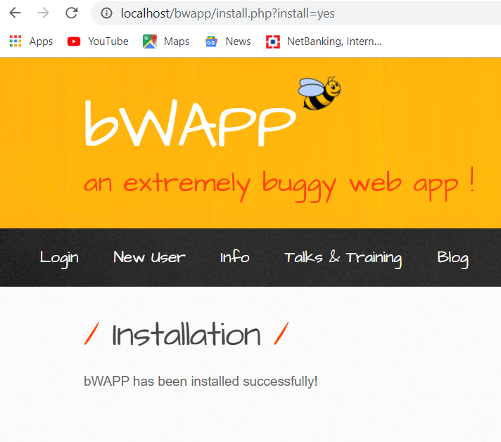

# bWAPP Installation Tutorial

Hey Guys! 👋

I'm back today with a tutorial on bWAPP installation!

## What is bWAPP?

**bWAPP** is a free and open-source deliberately insecure web application. bWAPP covers all major known web vulnerabilities. In simple terms, bWAPP is a buggy web app loaded with vulnerabilities, made for practicing how to defend against real-life web app bugs—legally! It's for security-testing and educational purposes only.

Hope no one wants to go to jail, so you can practice here in a safe environment! 😄

---

## Let's Get Started with the Installation Steps:

> **Note**: If you are using a PC or laptop, kindly switch off Windows Defender or any other antivirus software because bWAPP is a vulnerable web app, and your antivirus might detect it as a virus!

### Step 1: Install XAMPP Server

Since bWAPP is a PHP application that runs scripts on a server, you can use XAMPP to run bWAPP’s PHP scripts by hosting bWAPP with Apache and MySQL servers.

**XAMPP** is an Apache distribution that helps create a local host for testing purposes!

A **local host** is nothing but a local web server that actually runs on your own machine (computer) to run your vulnerable PHP scripts.

- **Download XAMPP**: [Click here to download XAMPP for Windows](https://www.apachefriends.org/index.html).
- **Installation**:
    - After downloading, click the `install-xampp-exe.png` file to install.
    - Follow the installation steps, and finally, click **Finish** to start the XAMPP Control Panel.


- **Start the Server**:
    - Upon starting XAMPP, it will ask for administrator access. Allow it to run!


- **Control Panel**:
    - Start the **Apache** and **MySQL** services as shown below.


    - To run your XAMPP server later, navigate to the parent directory where XAMPP is installed: `C:\xampp`.
    - Click `xampp-control.exe` to start the MySQL and Apache servers.

### Step 2: Set Up bWAPP

- **Download bWAPP**: [Click here to download bWAPP](https://sourceforge.net/projects/bwapp/).
- **Before Downloading**: 
    - Turn off Windows Defender and other antivirus software to prevent them from detecting bWAPP as a virus.
    - 
- **Extract and Install**:
    - Extract the downloaded ZIP file.
    - Copy the `bWAPP` folder from `bWAPP_latest` and paste it into the `C:\xampp\htdocs` directory.


- **Run bWAPP**:
    - Open Chrome (or any browser) and type `http://localhost/bWAPP/install.php`.
    - Click to install bWAPP.


### Troubleshooting Installation Errors
If you encounter an error during the bWAPP installation, follow these steps. [Click here to watch the error rectification video](https://www.youtube.com/watch?v=T9NbyQyYhNE).
1. **Error Message**:
    - You might see an error message like this in your browser:

    

2. **Edit `installation.php`**:
    - Open the `installation.php` file located in the `bWAPP` directory.
    - Add the following line of code at line 20:

    ```php
    mysqli_report(MYSQLI_REPORT_STRICT);
    ```

    - Your `installation.php` file should look like this after editing:

    

3. **Reference for Solution**:
    - This line of code helps to solve the error by enabling exception reporting for MySQLi. You can refer to this solution on the [mysqli_report](https://www.php.net/manual/en/mysqli.report.php) page.


    

After making this change, try the installation process again. This should resolve the error and allow you to proceed with the setup.


- **Complete Installation**:
    - After editing the `settings.php` file, click "Install" again.



### Step 3: Log in to bWAPP

- **Login Details**:
    - **Username**: `bee`
    - **Password**: `bug`
  


### Start Practicing!

You can now practice with any vulnerability you desire within this safe environment!


---

Hope this guide helps you get started with bWAPP. Enjoy exploring and learning in a secure, controlled environment! 🚀
